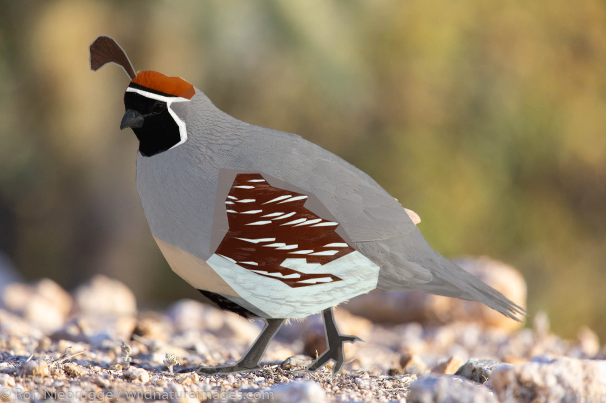

import BigQuail from './BigQuail.svelte';

I made a Gambel's Quail counter. 

Its like a "Like" button but better. 

They normally live in the bottom-right corner of posts but here's a big one for you to click:

<BigQuail url="/blog/2024-05-27-quail" client:only="svelte" />

It is a custom SVG that I made by drawing geometric vector shapes on top of a photo. When I export the shapes to SVG I've got a beautiful scalable male Gambel's Quail. 



When you click the quail not only does it do a little jump, it triggers a function that synthesizes an approximation of a [Gambel's Quail song](https://macaulaylibrary.org/asset/223146831).

```typescript
function playSound() {
    // Create the audio context
    if (!audioCtx) {
        audioCtx = new AudioContext();
    }

    // Set options variables
    let gain = 0.1;
    let oscType = 'sawtooth' as OscillatorType;
    let length = 0.35;
    let freqs = {
        start: 350,
        mid: 980 + randomNumber(0, 100),
        end: 840,
    };

    // Create a sawtooth oscillator node
    const osc = new OscillatorNode(audioCtx, { type: oscType });

    // The starting frequency is 350Hz, 
    // it linearly slides up to 1000-1100Hz, 
    // then back down to 840Hz
    osc.frequency.setValueAtTime(freqs.start, audioCtx.currentTime);
    osc.frequency.linearRampToValueAtTime(freqs.mid, audioCtx.currentTime + length / 2);
    osc.frequency.linearRampToValueAtTime(freqs.end, audioCtx.currentTime + length);

    // Create a gain node which slides linearly 
    // to the gain set in the options from 0 and back. 
    const gainNode = new GainNode(audioCtx);
    gainNode.gain.setValueAtTime(0, audioCtx.currentTime);
    gainNode.gain.linearRampToValueAtTime(gain, audioCtx.currentTime + length / 2);
    gainNode.gain.linearRampToValueAtTime(0, audioCtx.currentTime + length);

    // Create a bandpass filter node that moves with the oscillator frequency
    // but doubled, emphasizing the second harmonic and creating a more nasal sound.
    const filterNode = new BiquadFilterNode(audioCtx, { type: 'bandpass', Q: 1 });
    filterNode.frequency.setValueAtTime(freqs.start * 2, audioCtx.currentTime);
    filterNode.frequency.linearRampToValueAtTime(freqs.mid * 2, audioCtx.currentTime + length / 2);
    filterNode.frequency.linearRampToValueAtTime(freqs.end * 2, audioCtx.currentTime + length);

    // Patch all the nodes together
    osc.connect(gainNode).connect(filterNode).connect(audioCtx.destination);
    
    // Start the oscillator and stop it after the length of the sound
    osc.start();
    osc.stop(audioCtx.currentTime + length);
}
```

Part of why I can do this more easily is I ported my portfolio to [Astro](https://astro.build/). I can drop a Quail svelte component in, which calls a dynamic API route that lives within my project, which interacts with a database to persist the count. Every bit of code is in one git repo instead of spread out across multiple platforms. [Astro DB](https://astro.build/db/) adds some nice features that make working with a database in development and production more seamless. 

I expect to add more whimsy and interactive bits soon. 