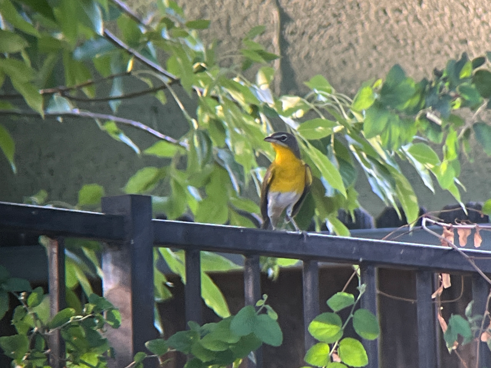
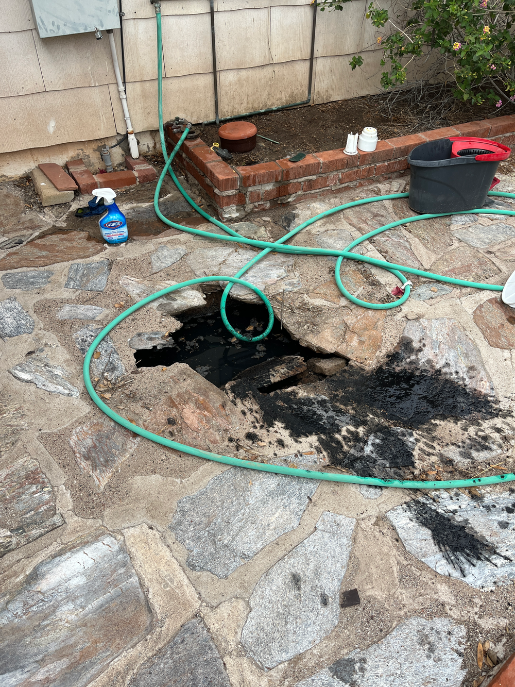
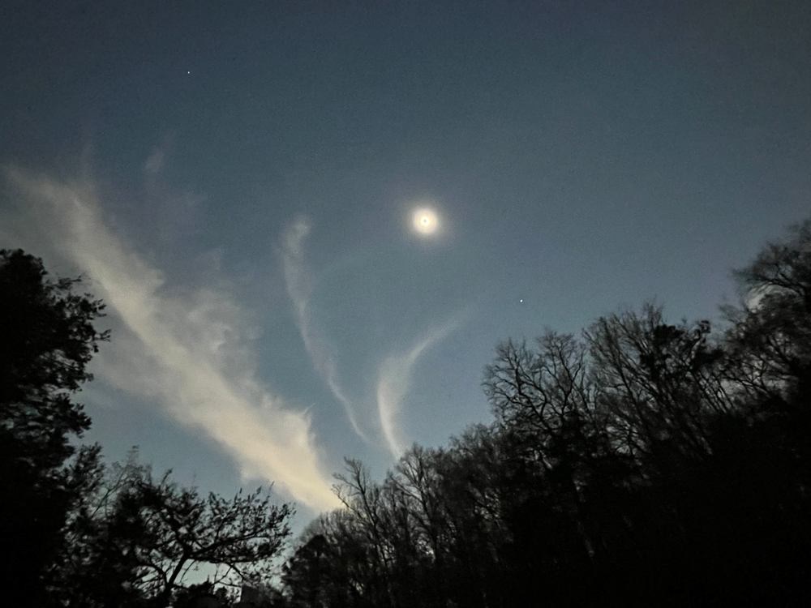
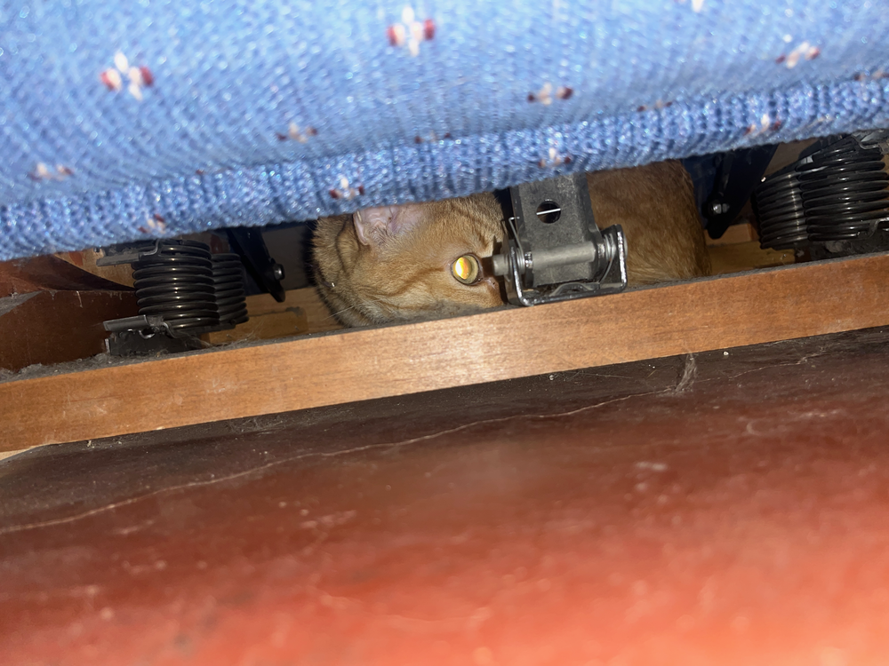
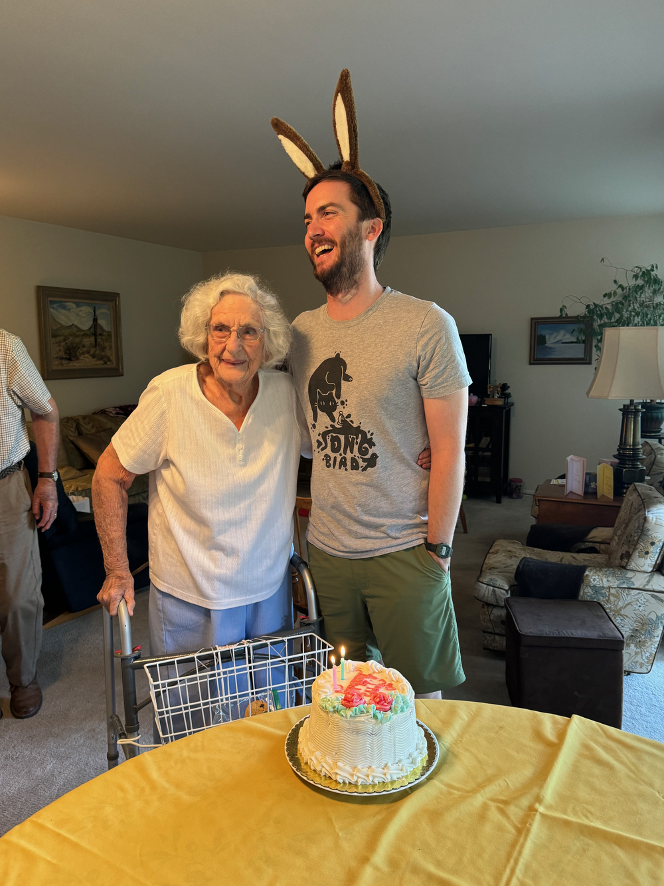
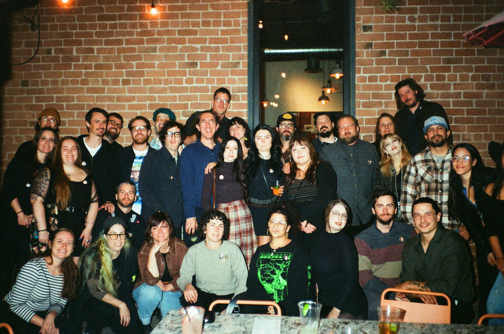
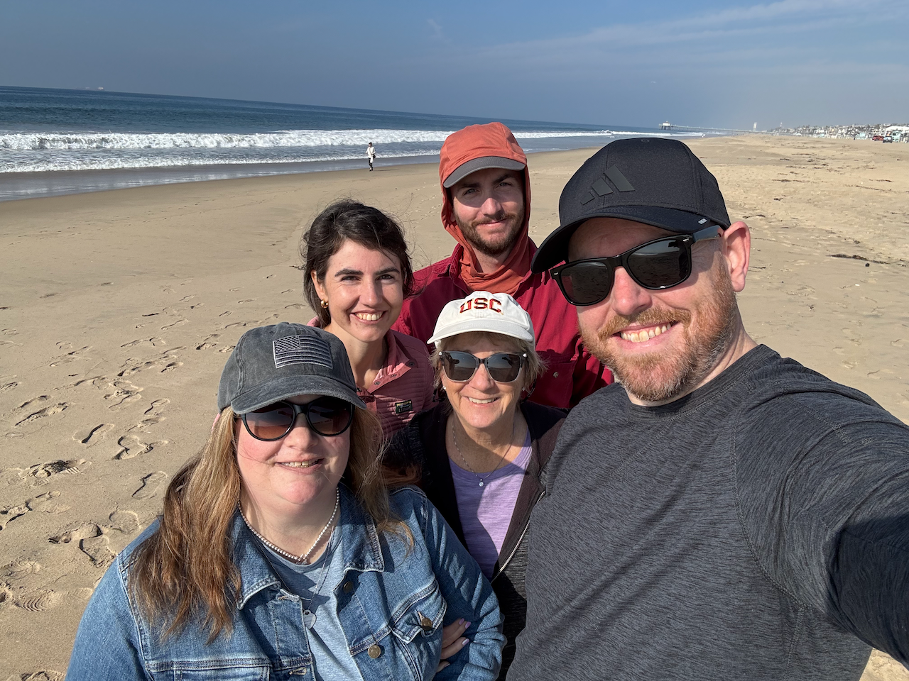
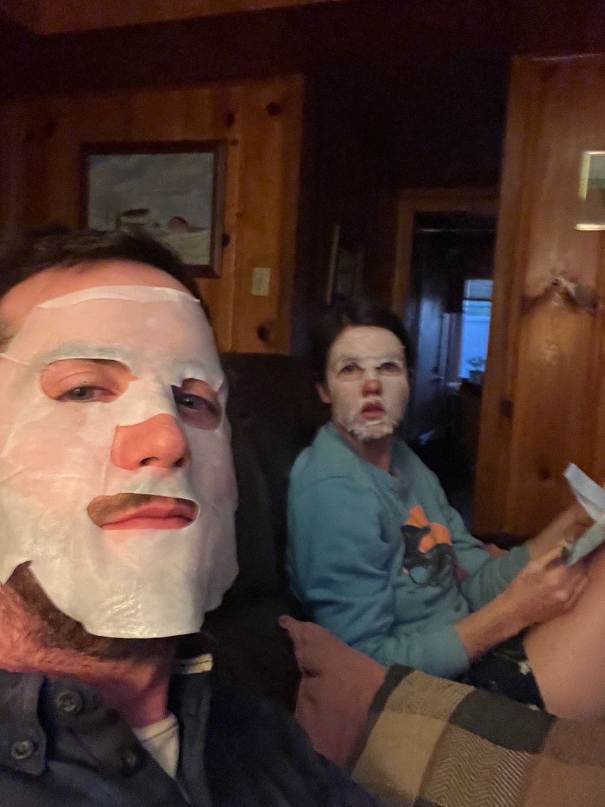

import Spacer from 'src/components/Spacer.astro'
import FamilyBeach from 'src/content/blog/2024-year-in-review/familybeach.png'
import Geoff from './geoff.png'

I saw 9 life birds.

-   [Curlew Sandpiper](https://ebird.org/checklist/S187945451)
-   [Purple Gallinule](https://ebird.org/checklist/S190261294)
-   [Allen's Hummingbird](https://ebird.org/checklist/S204753166)
-   [Oak Titmouse](https://ebird.org/checklist/S204753166)
-   [Royal Tern](https://ebird.org/checklist/S204879311)
-   [Parasitic Jaeger](https://ebird.org/checklist/S204879206)
-   [Swinhoe's White-eye](https://ebird.org/checklist/S204879086)
-   [Black Skimmer](https://ebird.org/checklist/S204973047)
-   [Black-vented Shearwater](https://ebird.org/checklist/S204973047)

I saw 9 new Arizona birds.

-   [Laughing Gull](https://ebird.org/checklist/S183141611)
-   [Curlew Sandpiper](https://ebird.org/checklist/S187945451)
-   [Purple Gallinule](https://ebird.org/checklist/S190261294)
-   [Northern Waterthrush](https://ebird.org/checklist/S193757856)
-   [Blackpoll Warbler](https://ebird.org/checklist/S194480456)
-   [Yellow-throated Warbler](https://ebird.org/checklist/S198149901)
-   [Bay-breasted Warbler](https://ebird.org/checklist/S199709698)
-   [Common Tern](https://ebird.org/checklist/S200237909)
-   [Blackburnian Warbler](https://ebird.org/checklist/S201167278)

I became an eBird reviewer for Maricopa county.

I saw a [Yellow-breasted Chat](https://ebird.org/checklist/S194355113) from my parent's pool in September.

 

The first day of the year was dystopian. At sunrise, Nell and I went out to do [CAP-LTER](https://globalfutures.asu.edu/caplter/) bird counts in downtown Phoenix along the Salt River basin. The air was thick with smoke from fireworks and smog. Everywhere we went along the river reeked of sewage and trash. The vibes were terrible.

{/*   */}

Nell and I went to the Chiricahuas in March to camp with our friend Iza. It snowed almost the entire time we were there. It was great.

{/*   */}

As Nell and I decided whether to buy the house we live in and replace the roof in order to keep the house insured, the ground fell out from under my feet. I was standing on the flagstone and concrete outside our kitchen window, then suddenly I was standing knee-deep in a black greasy crater filled with mosquitos and roaches. I said to Nell, "This is a sign. We can't buy this house."

We decided to buy the house.

 

We went to Memphis/Arkansas to see the total solar eclipse in April with some old friends. I really can't recommend experiencing a total solar eclipse enough. [Nell published a beautiful lyrical essay](https://nellsmithwriter.com/2024/09/27/essay-in-southern-humanities-review-fragments-of-bone-fragments-of-light/) partly inspired by the 2018 eclipse in Wyoming.

 

In July, roof work started in earnest. It was chaotic and stressful. Goose hated it.

House work or the threat of it lingered through October when we successfully maintained home insurance.

 

In July, I turned 36 and my grandmother turned 101.

 

[I got a new job](/blog/2024-08-new-job/). We got Goose a fancy water fountain. He loves it. 

{/* Nell got a beautiful wedding dress on discount from a very strange store in the Prescott Mall.  */}

Nell and I went to the Prescott Mall. We stopped in to get samosas and mango lassi from an Indian food / Disney + Harry Potter themed english tea room called Mr. Moussetache Cafe. A store across the walkway called Foot Fetish Clothing Company beckoned us to explore the mall more. We wandered into a general store with no name having a going out of business sale. Nell found a beautiful wedding dress.

I had some melanoma removed from my shin by a constantly cursing dermatologist.

Nell and I tripled or quadrupled our house plants. Nell mulched the yard. I built a [home](https://www.robinsloan.com/notes/home-cooked-app/) [cooked](https://maggieappleton.com/home-cooked-software) plant watering app.

An old friend and my uncle died suddenly in the fall and winter. I got to celebrate life with old friends and family.

<Spacer />

A lot happened. Some of it was great, some of it was terrible. A lot of it was stressful and a lot of groundwork was laid for a hopefully calmer, fruitful year ahead, at least in our little corner of the world.

Here's lookin' at you 2025.

