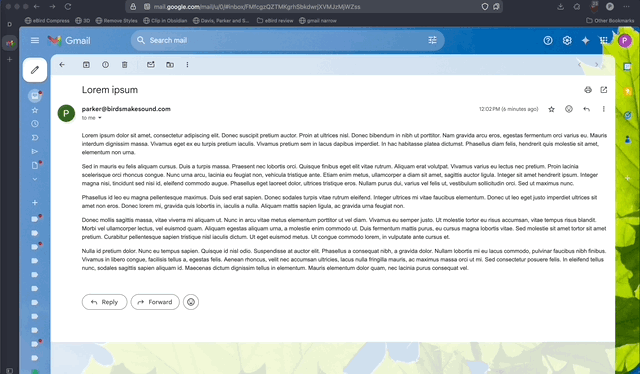

## Motivation

When you have a wide computer monitor, it can be hard to read long lines of text that span across the entire screen.

I use Google Mail for work and it does not have any built-in functionality to limit email line length. This can make reading complex emails harder than it needs to be.

I find around 60-ish characters per line works well for me, and there is [research](https://baymard.com/blog/line-length-readability) that backs that up.

I tried out some browser plugins that allow you to inject custom CSS when visiting certain sites, but I couldn't quite get them to work with Google Mail for some unknown reason. So instead of troubleshooting that, I wrote a small [bookmarklet](https://en.wikipedia.org/wiki/Bookmarklet).

<!-- prettier-ignore -->
```js
javascript:(()=>{try{let elements=document.body.querySelectorAll(".gt.ii");if(elements.length){elements.forEach(el=>el.style.maxWidth="60ch")}else{console.log("No matching elements found")}}catch(e){console.log("Error:",e)}})();
```

## Demo



## How to use it

You can drag this link to your bookmarks bar on your browser: <a href='javascript:(()=>{try{let elements=document.body.querySelectorAll(".gt.ii");if(elements.length){elements.forEach(el=>el.style.maxWidth="60ch")}else{console.log("No matching elements found")}}catch(e){console.log("Error:",e)}})();'>NarrowifyGmail</a>

~ or ~

1. Create a random bookmark (this blog post for instance)
2. Open your bookmark manager
3. Edit the bookmark you just created, rename it to whatever you want, and replace the URL with the code above
4. Save your new bookmark to your bookmarks bar

Now, when you're reading a message in Google Mail, you click on the bookmarklet you just created, and it sets a maximum width on all email messages on the current page. Note this only works for currently expanded emails, so you'll need to re-run the bookmarklet whenever new messages are loaded.

## What is it doing?

```js
// unminified script
javascript: (() => {
    try {
        let elements = document.body.querySelectorAll('.gt.ii');
        if (elements.length) {
            elements.forEach((el) => (el.style.maxWidth = '60ch'));
        } else {
            console.log('No matching elements found');
        }
    } catch (e) {
        console.log('Error:', e);
    }
})();
```

Essentially, it selects all message elements on the current page (on gmail these all have a class of `.gt` and `.ii`) then sets the `maxWidth` of these elements to `60ch`.

I used the `ch` unit for a thrill, which means it sets the message to the width of 60 `0`'s in the current font. [There are lots of units to choose from](https://web.dev/learn/css/sizing/).

I then strip out the whitespace using [uglify-js](https://www.npmjs.com/package/uglify-js).

```sh
npx uglify-js gmail-bookmarklet.js -o gmail-bookmarklet.min.js
```

## esbuild

Previously I've used [esbuild](https://esbuild.github.io/api/#minify) to minify bookmarklet scripts.

```sh
npx esbuild gmail-bookmarklet.js --minify --outfile=gmail-bookmarklet.min.js
```

This works and also applies variable shortening for maximum optimization but it strips out the Javascript URL protocol at the beginning, so I would need to manually add that back in every time I ran it. Not ideal.

## Go forth!

With your new bookmarklet you can now read some emails while easing the strain on your eyes and mind.
