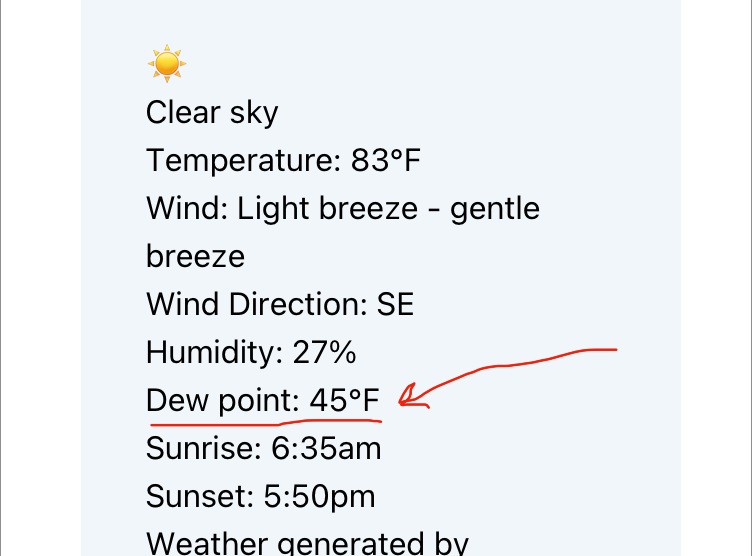

From [weather.gov](https://www.weather.gov/arx/why_dewpoint_vs_humidity):

<blockquote class="flow">

The dew point is the temperature the air needs to be cooled to (at constant pressure) in order to achieve a relative humidity (RH) of 100%. At this point the air cannot hold more water in the gas form. If the air were to be cooled even more, water vapor would have to come out of the atmosphere in the liquid form, usually as fog or precipitation.

The higher the dew point rises, the greater the amount of moisture in the air. This directly affects how "comfortable" it will feel outside. Many times, relative humidity can be misleading. For example, a temperature of 30 and a dew point of 30 will give you a relative humidity of 100%, but a temperature of 80 and a dew point of 60 produces a relative humidity of 50%. It would feel much more "humid" on the 80 degree day with 50% relative humidity than on the 30 degree day with a 100% relative humidity. This is because of the higher dew point.

So if you want a real judge of just how "dry" or "humid" it will feel outside, look at the dew point instead of the RH. The higher the dew point, the muggier it will feel.

</blockquote>

Al from North Carolina requested that I add dew point to RainCrow, as it is generally a better indicator of how humid it feels. I made those changes [yesterday](https://github.com/parkerdavis1/raincrow/commit/5e1fcb9a5a0ef8f37c955e6358ad2066301d49c3).

Check it out at [raincrow.app](https://raincrow.app)
