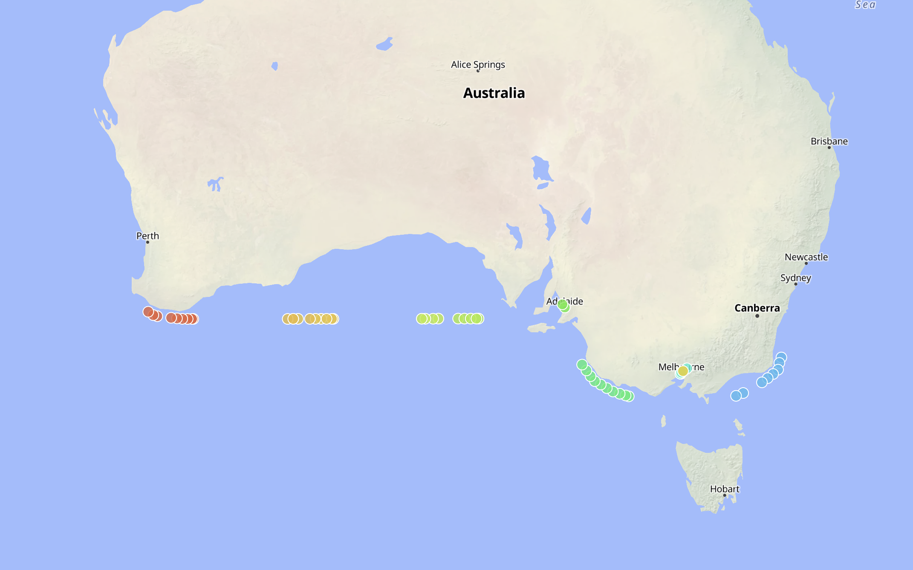

## New Projects

I added three new/old projects:

[**Happy Plants**](/projects/happy-plants) now has a project page. There's no public demo or source code available (_on purpose_) but at least now it is documented.

[**eBird Compress**](/projects/ebird-compress) is an oldie but a goodie. I use it all the time, check it out if you haven't already. 

[**Birds Make Sound**](/projects/birds-make-sound) is an even older oldie and goodie.

The other fun update is you can view recent [**RainCrow**](/projects/raincrow) useage [on a map](https://timezone.parker.town/map). Right now, it looks like someone is sailing along the coast of Austrailia and eBirding along the way! So cool. 

## Bird Projects

I wanted there to be a page for birding folks to easily find the birding tools I've built. RainCrow organically lets other birders know it exists every time its used but the other tools are a little harder to discover, so: bird projects are now noted with a 🦆 and there is a [birding projects](/projects/birding) page.

Another reason for these changes is I wanted there to be a cozy spot for my new little audio tool to nestle into...
