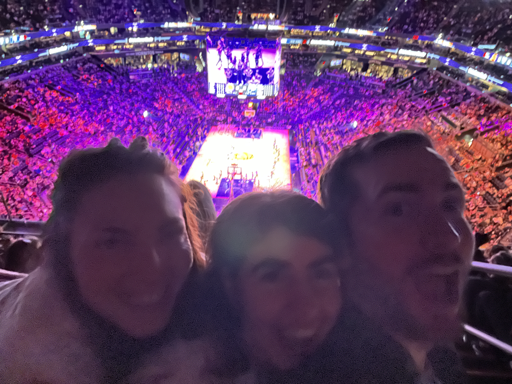
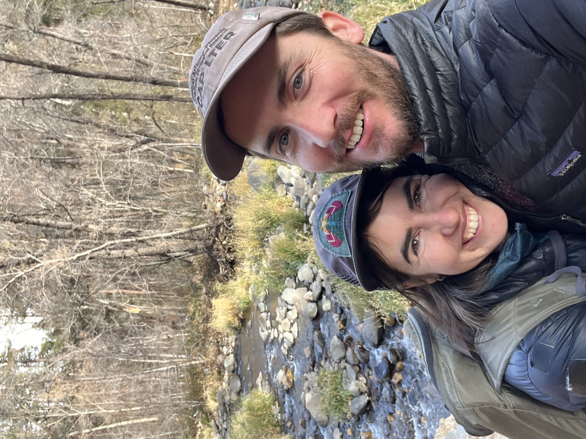

import ConfettiWrapper from '@components/ConfettiWrapper.astro'

I'm back from a brief blog hiatus. January is quickly coming to a close so I figure I ought to give a brief update on what has been going on for me. Since last time there have been holiday celebrations, several birthdays, quality time with friends and family, work done for CAP-LTER and...

...I went to my first Suns/NBA game:

...and I got engaged!

<ConfettiWrapper>

</ConfettiWrapper>

## Coding

I have been doing quite a bit of coding as well. I've been hard at work on the CCAM website and we're almost ready to launch. I'm working on making [RainCrow](/projects/raincrow) a full-blown SaaS app with authentication and payment processing that allows people to pay for weather requests when the freebies run out. I've also been learning about data visualization with [D3](https://d3js.org/) and [Observable Plot](https://observablehq.com/plot/) in order to start working on a web application to allow for more intuitive data exploration for the [CAP-LTER datasets](https://sustainability-innovation.asu.edu/caplter/research/long-term-monitoring/bird-censuses/).

### Job Search

I had my first meeting with a tech recruiter recently which went well. The position ended up not being a great fit for me but it was refreshing to have some interest, especially in a job market flooded with many experienced developers looking for work.

More soon.
