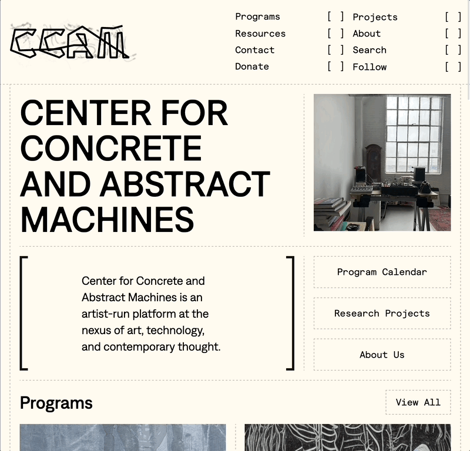

import RelatedPosts from '@components/RelatedPosts.astro';

## Links

<ProjectLinks githubUrl={frontmatter.githubUrl} liveUrl={frontmatter.liveUrl} />

## Screenshot

## Overview

I was brought on to consult on the site rebuild for CCAM but ended up building the entire site. [Ioan Buțiu](https://www.ioan.website/) did a great job on the initial design.

## Noteworthy stuff that I will write about soon

- Gallery metadata template node script
- Intersection observer and lazy loading p5 library -> rewriting CCAM sketch in vanilla JS
- First time using container queries
- First time setting up 301 redirects
- Using [HTMZ](/blog/htmz) technique to load galleries; emitting custom DOM events to load lightbox script
- Slow mode for slower devices / prefers-reduced-motion
- Surprisingly tricky dashed CSS Grid spacers

## Posts tagged with "CCAM"

<RelatedPosts tag="CCAM" />
