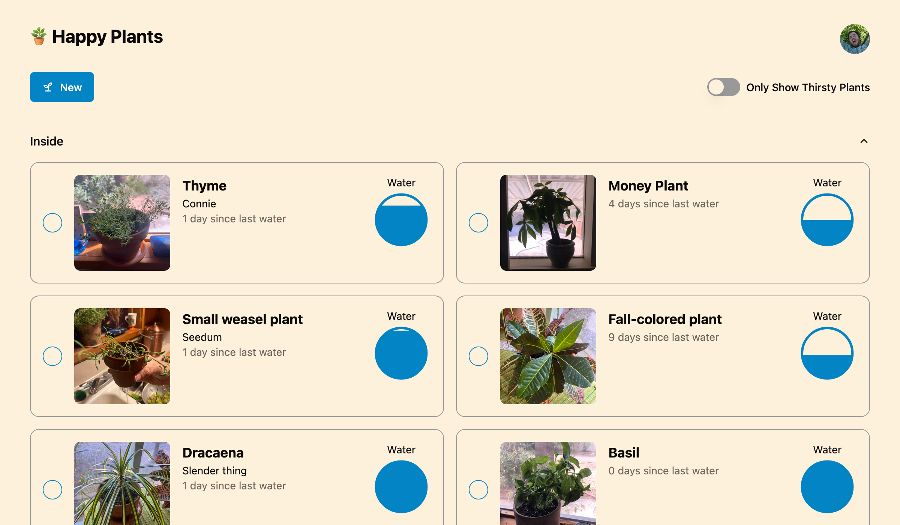
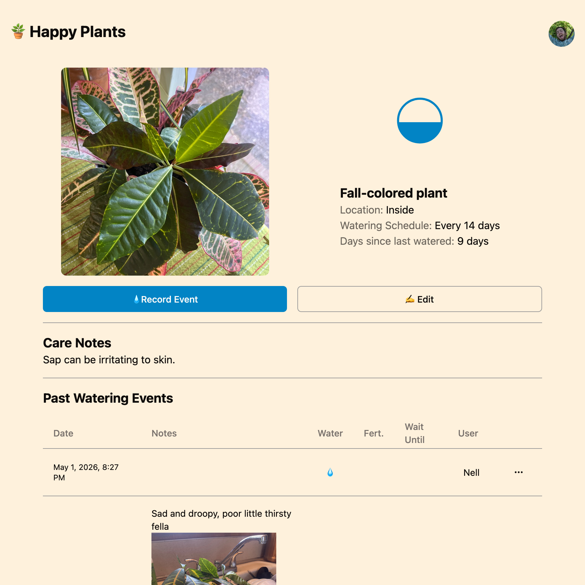
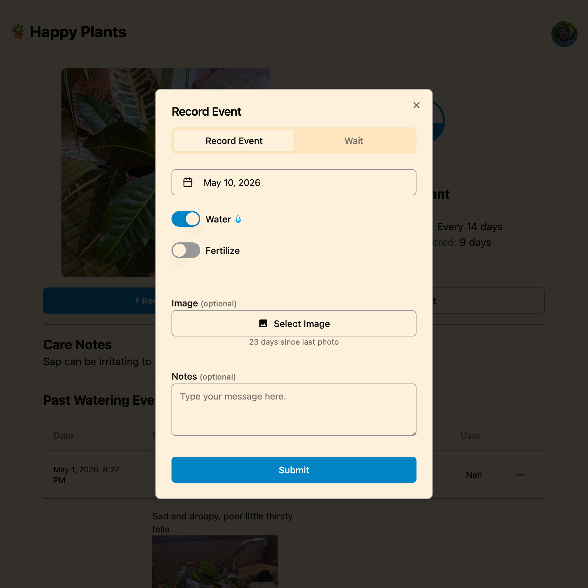

import RelatedPosts from '@components/RelatedPosts.astro';

## Description

Happy Plants is a [home-cooked](https://www.robinsloan.com/notes/home-cooked-app/) web application that tracks the watering of my plants, inspired by a stream from [Steve Krouse and Maggie Appleton](https://www.youtube.com/live/kJTeyskdYpk?si=ht3p63Qlx-ssKZnb).

### Features

- Fields for species, nickname, notes on care, watering schedule
- Complete history of watering events
    - with images to track how the plant looks over time
- Custom groupings of plants (eg. inside, front yard, gulch, etc.)
- Synthesized fizzy bubbling water sound
- Water multiple plants at once (eg. when it rains)
- Filters (eg. only show thirsty plants)

### Technology

- Sveltekit
- Typescript
- Drizzle ORM
- SQLite
- Cloudflare R2 for photo storage
- Optimized images
- Email + password auth

### Future Goals

- Add local-first offline support

## Screenshots

{/* ## Posts related to "happy-plants" */}

{/* <RelatedPosts tag="happy-plants" /> */}
