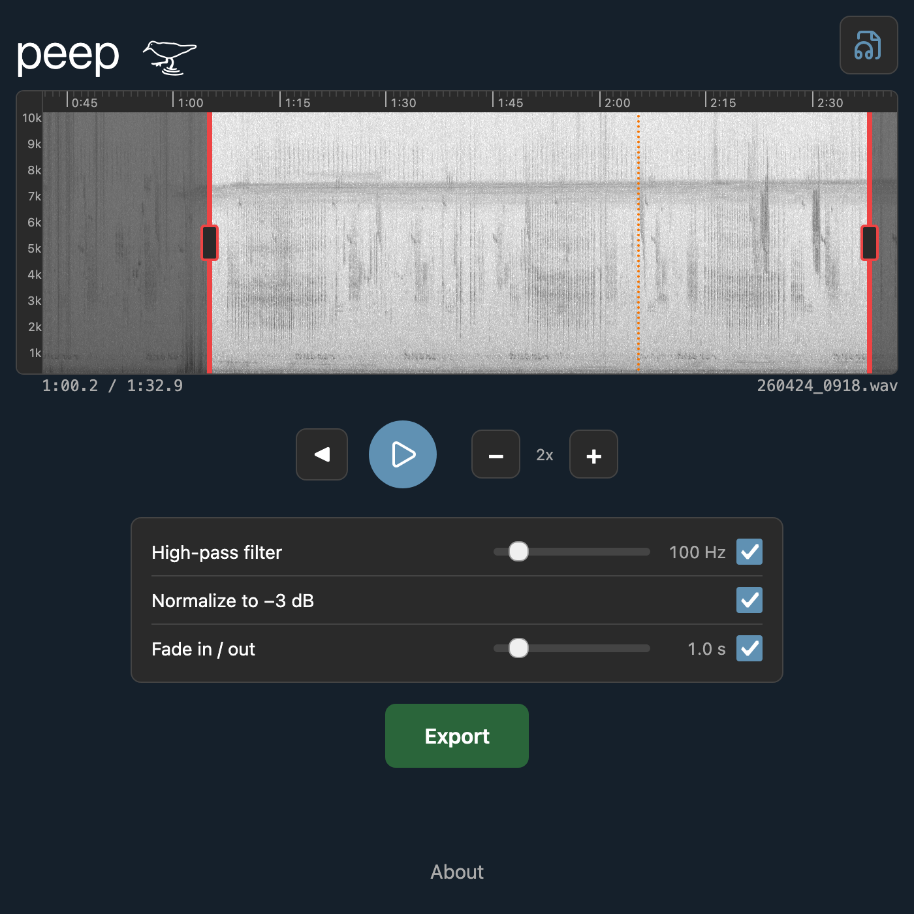

import RelatedPosts from '@components/RelatedPosts.astro';
import BirdingProjectCallout from '@components/BirdingProjectCallout.astro';

<BirdingProjectCallout />

## Links

<ProjectLinks githubUrl={frontmatter.githubUrl} liveUrl={frontmatter.liveUrl} />

## Screenshot

## Why peep?

**peep** is a web app for editing recordings before uploading to eBird. It does a small set of audio edits, and does them well:

- Trim the beginning and end of the recording with short fades
- Apply a light high-pass filter to lessen low-frequency noise
- Normalize gain to -3dB

The app is designed for mobile users who want to edit audio recordings on their phone following the [eBird audio preparation guidelines](https://ebird.freshdesk.com/en/support/solutions/articles/48001064341-audio-preparation-and-upload-guidelines). It is just as useful for Desktop users, as it simplifies trimming and makes light high-pass filtering and normalization essentially automatic. 

There are many capable programs I enjoy using for audio editing. However, the process of loading audio files from [Merlin](https://merlin.allaboutbirds.org/) (or any audio recording app) onto my computer just to make a few basic edits is _just_ enough of a hassle that I will let audio recordings pile up. And in those cases, with many audio files to process, doing the same basic edits for each file can get tedious. **peep** helps prevent this build up in the first place and makes processing more streamlined. 

It is also for folks who don't yet edit their audio recordings at all. In addition to the paper cuts described above, learning the techniques and terminology of a new audio editing program can be daunting. **peep** lowers the barrier to entry so everyone's recordings can sound their best. 

## No, why is it named peep?

1. A peep is a cute small shorebird.
2. A peep is a sound
3. _What more do you need?_

## Technology

**peep** uses:
- Svelte/Sveltekit
- Typescript
- Web Audio API

It is intented to be used as a PWA (progressive web app). Save it to your homescreen/dock and use it just like any other app.

## Posts related to "peep"

<RelatedPosts tag="peep" />
