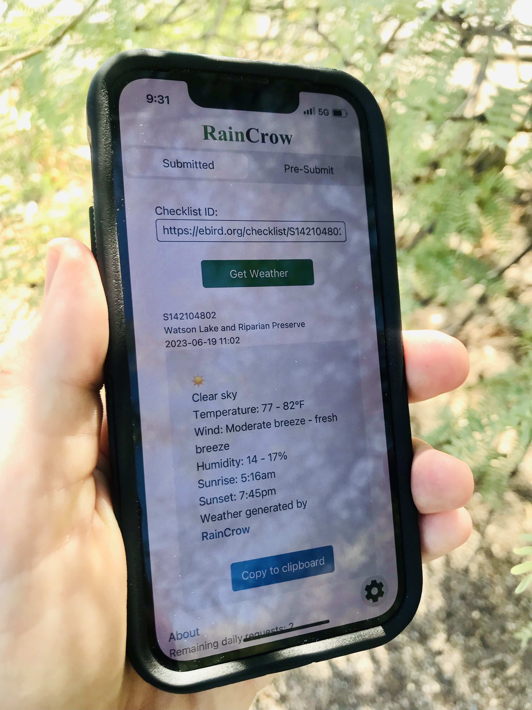
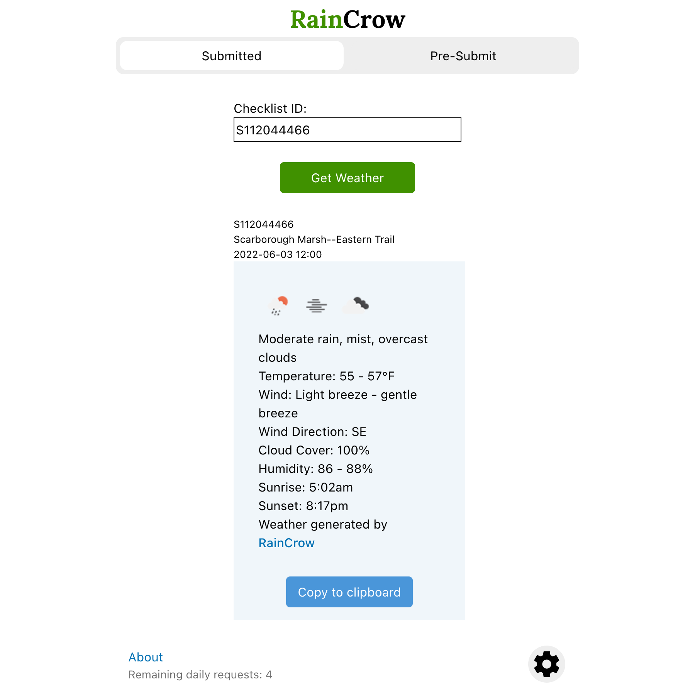
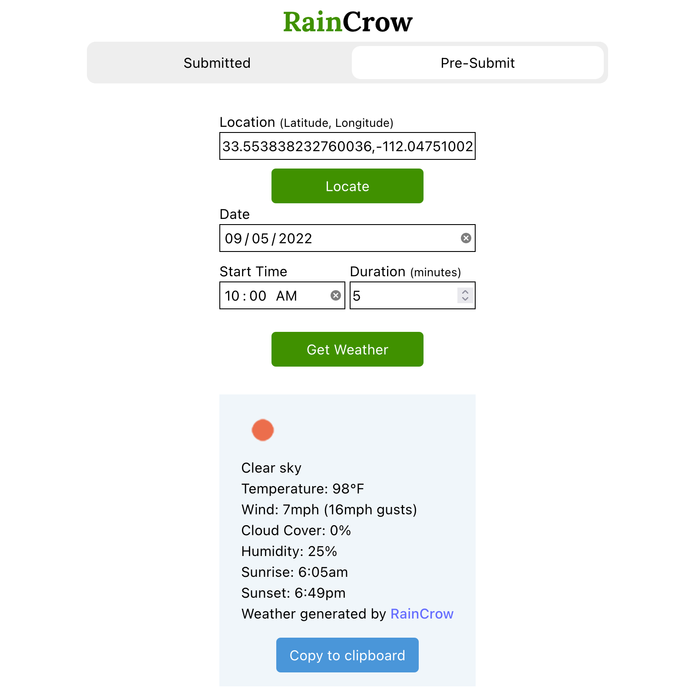

## Links

<ProjectLinks githubUrl={frontmatter.githubUrl} liveUrl={frontmatter.liveUrl} />

## Screenshot

## Background

[eBird](https://ebird.org/about) is a global citizen science database where users submit checklists to contibute to a shared understanding of the world's bird life.

As a somewhat obsessive eBird user, I like to include weather observations in the comments for my checklists. Often when birding away from urban areas, the cell service is spotty to nonexistant so looking up current conditions in a standard weather app doesn't work. I wanted to create a streamlined way to fetch historical weather data for a specific location and time after returning from far afield while also practicing writing asynchronous javascript and fetching data from APIs.

## Description

To get weather data for a checklist that is already submitted to eBird, all the user has to do is input the checklist ID (or the entire URL) for a checklist and click "Get Weather". The app gathers the weather conditions for the location and duration of the checklist and displays them below the input form. The data is copied with the "Copy to Clipboard" button and can now be pasted in the comments section for a given checklist.

If the user wants to gather weather data before a checklist is submitted, they can use the "Pre-Submit" form. This removes the need to edit a checklist after submitting it. It is especially useful for shared checklists, allowing weather observations to be shared with all observers.

It does require more input from the user, but I tried to make the input as painless as possible. The locate button automatically inputs your current GPS coordinates. The date and start time automatically pre-fill the current date and the time rounded down to the nearest hour. The duration accepts minutes, mimicking data fields on eBird.

